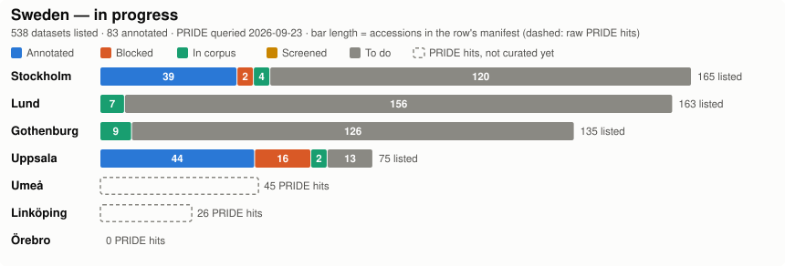
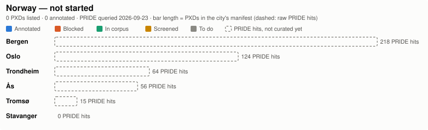
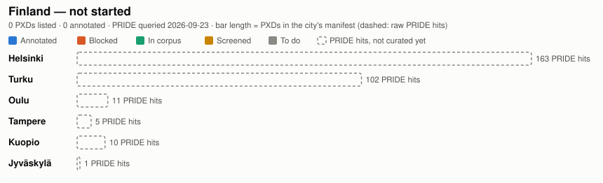
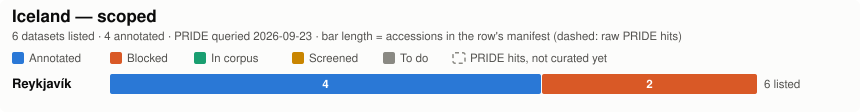
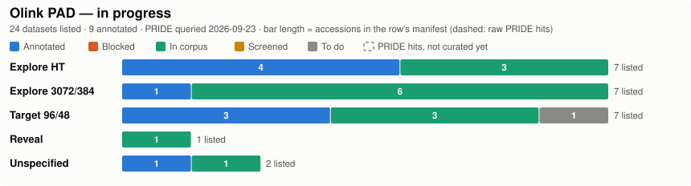

# NordicSDRF

Annotate every Nordic-affiliated PRIDE proteomics dataset with a validated
[SDRF](https://github.com/bigbio/proteomics-metadata-standard) file, worked
country by country and city by city, starting with Sweden.

This repo is a **campaign tracker**, not an annotation engine. The actual
annotation work is done by [`sdrf-skills`](https://github.com/bigbio/sdrf-skills)
(the skill pack you've used before — `sdrf-metascreen`, `sdrf-annotate`,
`sdrf-validate`, `sdrf-fix`, `sdrf-review`, `sdrf-adversarial-review`, ...).
NordicSDRF holds the city manifests, the screening/annotation outputs, and the
progress tracker; finished SDRFs eventually get contributed upstream to
[`sdrf-annotated-datasets`](https://github.com/bigbio/sdrf-annotated-datasets)
via `sdrf-contribute`.

Annotation is three tiers, cheapest first: local GPU (dedup / triage) → Codex
(`sdrf-metascreen`) → Claude (`sdrf-annotate` + review). Setup, Ollama, Slurm,
and how to watch a run are in [`docs/workflow.md`](docs/workflow.md).

## Repository layout

```
NordicSDRF/
├── config.yml                  # single source of truth: countries → cities → counts/status
├── lists/                      # curated city manifests (one PXD per line)
│   ├── sweden/
│   │   ├── stockholm.txt
│   │   ├── gothenburg.txt
│   │   ├── lund.txt
│   │   └── uppsala.txt
│   ├── denmark/
│   │   └── roskilde.txt
│   ├── iceland/
│   │   └── reykjavik.txt
│   └── norway/
│       └── tromso.txt
├── olink_pad/                 # Olink datasets in PRIDE's affinity archive, one PAD list per platform
│   └── <platform>.txt          #   (explore_ht, explore, target, reveal, unspecified) — build_pad_manifest.py
├── results/                   # sdrf-metascreen output, resumable TSV + .log per city
│   ├── pride_hits/<country>/<city>.txt   # raw PRIDE keyword candidates (update_status.py)
│   ├── logs/                  # headless annotation traces (gitignored)
│   └── sweden/
│       ├── <city>_screen.tsv
│       └── <city>_in_corpus.txt          # manifest PXDs already in bigbio/sdrf-annotated-datasets
├── annotations/                # sdrf-annotate output — same shape as sdrf-skills/annotations
│   ├── <PXD>.sdrf.tsv
│   ├── <PXD>.report.md
│   ├── BLOCKED.md              # screened `include` but not annotatable, and why
│   └── DUPLICATES.md           # overlapping depositions found (checksum-verified)
├── tables/
│   ├── countries.tsv           # country, status, PRIDE query date — written by update_status.py
│   └── <country>.tsv           # per-city numbers, one row per city — the plots read these
├── status/
│   ├── <country>.md            # per-country status page, generated by update_status.py
│   └── plots/<country>.svg     # horizontal bar chart per city, drawn from tables/ by plot_status.py
├── criteria/
│   ├── nordic_cities.md        # cities × institutions × search terms × rough PRIDE hit counts, all 5 countries
│   ├── nordic_screen.md        # inclusion rules + extract fields for sdrf-metascreen
│   └── sea_cities.md           # SEA country/city inventory for a later campaign; not in config.yml
├── docs/
│   └── workflow.md             # local GPU, Codex, Claude, Slurm, how to watch a run
└── scripts/
    ├── annotate_local.sh            # sdrf-annotate via Claude Code + local Ollama (zero tokens); NORDIC_BATCH=1 for headless
    ├── annotate_slurm.sbatch        # Slurm array wrapper: one task per manifest line
    ├── build_manifest.py            # tier 1: PRIDE keyword search → verify country in each record → lists/<country>/<city>.txt
    ├── build_pad_manifest.py        # every public PAD in PRIDE → Olink ones → olink_pad/<platform>.txt
    ├── daily_queue.py               # next N PXDs to annotate today (skip corpus / done / blocked / running)
    ├── update_status.py             # PRIDE hits + corpus overlap + local progress → config.yml, README, status/
    ├── plot_status.py               # tables/<country>.tsv → status/plots/<country>.svg (called by update_status.py)
    ├── trace_summary.py             # one-line summary of a results/logs/<PXD>.*.jsonl run trace (live or finished)
    ├── check_existing_coverage.py   # tier 1: dedup against sdrf-annotated-datasets + BLOCKED/DUPLICATES
    └── local_triage.py              # tier 1: local Ollama pre-screen of a city manifest
```

`sdrf-skills` is used as an external dependency, not vendored — either a
sibling checkout (`../sdrf-skills`, already present on this machine, and the
default recorded in `config.yml`) or a git submodule if you want the repo
self-contained and pinned to a version.

`config.yml` is the single manifest: which sibling tools to use, the
tier-1/2/3 pipeline assignment, and per-country/per-city search terms, PXD
counts and progress counters. The numeric fields are machine-written by
`scripts/update_status.py`, which also regenerates the charts below,
`status/<country>.md`, `tables/`, and `status/plots/`. Edit names, search
terms and notes by hand. A city is scoped as soon as `lists/<country>/<city>.txt`
exists — you do not need to add `pxd_list` in `config.yml` first.

## Current status

Charts below are generated. To check a live annotation run, read a JSONL
trace, or refresh the numbers from files on this machine (no tokens), see
[Checking status locally](docs/workflow.md#checking-status-locally).

<!-- status:begin -->
One chart per country, one bar per city (shared x scale within a country). A
curated city's bar is its manifest (`lists/<country>/<city>.txt`), split so every PXD
sits in exactly one block, first match wins: *Annotated* (SDRF in `annotations/`),
*Blocked*, *In corpus* (already has an SDRF in [`bigbio/sdrf-annotated-datasets`](https://github.com/bigbio/sdrf-annotated-datasets),
checked against local checkout (2026-09-25)), *Screened*, *To do*.
A city without a manifest shows a dashed outline sized by its raw PRIDE full-text
hit count (unioned over `search_terms` in `config.yml`, queried 2026-09-23). *Olink PAD*
is every public Olink dataset in PRIDE's affinity archive, one row per platform
(`olink_pad/<platform>.txt`, rebuilt by `python scripts/build_pad_manifest.py`).
The numbers behind each chart are in `tables/<country>.tsv`. Regenerate with
`python scripts/update_status.py`; redraw the charts alone from `tables/` with
`python scripts/plot_status.py`.

### Sweden — in progress



### Denmark — in progress


### Norway — in progress



### Finland — in progress



### Iceland — in progress



### Olink PAD — in progress


<!-- status:end -->

No duplicates found within or across the four Swedish city lists. Two
anomalies to resolve before screening:

- `lists/sweden/stockholm.txt` line 1 is `PRD000423`, an old pre-`PXD`
  ProteomeXchange accession that ProteomeCentral rejects outright — resolve it
  to its current `PXD` id or drop it.
- `lists/sweden/uppsala.txt` contains Utrecht false positives `PXD001817`,
  `PXD004529`, and `PXD007189`: their PI addresses contain *Uppsalalaan 8,
  Utrecht* and PRIDE records `countries: [Netherlands]`. Keyword-built
  manifests will contain more of these; tier 1 should require a Nordic country
  in the PRIDE record's `countries` / affiliation fields before an accession
  goes to screening.

## Nordic cities

`criteria/nordic_cities.md` scopes the whole campaign: for each of the five
countries it lists the cities, the institutions and core facilities behind
them, the search terms that find them in PRIDE (English spellings first —
diacritic forms return almost nothing), a rough PRIDE full-text hit count per
city (queried 2026-09-23), and the known false-positive traps. The candidate
cities are also recorded per country in `config.yml` as `candidate_cities`.

| Country | Cities that matter | PRIDE hits (country) | Status |
|---|---|---:|---|
| Sweden | Stockholm, Uppsala, Gothenburg, Lund (+ Umeå, Linköping, Örebro, small) | 1149 | in progress |
| Denmark | Copenhagen (CPR, Rigshospitalet), Odense (SDU), Aarhus, Aalborg, Lyngby (DTU), Roskilde | 1600 | in progress (Roskilde) |
| Norway | Bergen (PROBE), Oslo (OUS), Trondheim (NTNU/PROMEC), Ås (NMBU), Tromsø, Stavanger | 461 | not started |
| Finland | Helsinki/Espoo, Turku, Oulu, Tampere, Kuopio, Jyväskylä | 205 | not started |
| Iceland | Reykjavík (mostly affinity proteomics, little in PRIDE) | 6 | in progress |

Suggested order after Sweden: Denmark, Norway, Finland, Iceland. To scope a
city, run the tier-1 manifest builder — PRIDE has no working country filter,
so it unions the city's `search_terms` from `config.yml`, fetches every
candidate record and keeps an accession only when the record itself confirms
the country (`countries`, a submitter's `country`, or a city/institution term
in an affiliation string):

```bash
python scripts/build_manifest.py denmark roskilde --dry-run       # see the evidence first
python scripts/build_manifest.py denmark roskilde                 # writes lists/denmark/roskilde.txt + results/denmark/roskilde_candidates.tsv
python scripts/update_status.py --no-pride --corpus github        # picks up the new .txt, redraws README charts
```

Iceland was scoped this way: 65 keyword candidates → 3 confirmed PXDs (all
Rolfsson lab, University of Iceland) + 1 legacy `PRD` id; 61 rejected, e.g.
"deCODE" matching *decode*, and a Norwegian dataset that cites Iceland. The
same run on `lists/sweden/uppsala.txt` would have rejected the Utrecht dataset.

Daily queue, local GPU annotation, Slurm, and the review gate:
[`docs/workflow.md`](docs/workflow.md).

```bash
python scripts/daily_queue.py iceland
python scripts/update_status.py --no-pride --corpus github
```

## Next steps

1. Resolve `PRD000423` in the Stockholm list.
2. Write `criteria/nordic_screen.md` (Swedish institution/city affiliation,
   MS-based proteomics scope, any exclusions you want — e.g. non-human only).
3. Write `scripts/check_existing_coverage.py` and `scripts/local_triage.py`
   (tier 1 automation in [`docs/workflow.md`](docs/workflow.md)).
4. Run Stockholm end-to-end first as a pilot to tune `dig_passes` and the
   local triage model choice before scaling to the other three cities.
